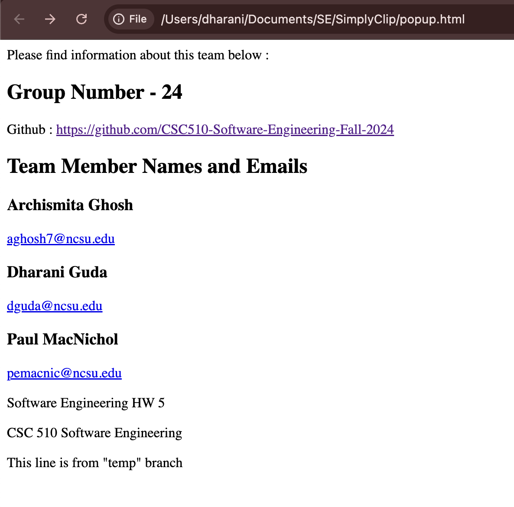

 

# HOMEWORK 5 - GIT

This repository contains the code for the team-info webpage that provides details about our teammates and our contact information.

# Repository structure:

 * [README.md](./README.md) : Description of repository
 * [LICENSE.md](./LICENSE.md) : License for the project
 * [INSTALL.md](./INSTALL.md) : Instructions to set up the project
 * [CONTRIBUTING.md](./CONTRIBUTING.md) : Guidelines for contributing to this project
 * [CODE-OF-CONDUCT.md](./CODE-OF-CONDUCT.md) : Expected code of conduct to contribute
 * [.gitignore](./.gitignore) : List of untracked files
 * [team-info.html](./team-info.html) : Webpage that provides team's info. 

## Team-info Webpage

